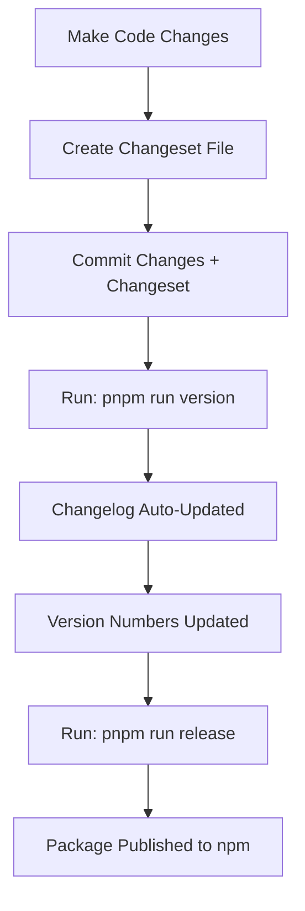

# Changeset Workflow Guide

This document explains how the automatic changelog generation works in the Oumla SDK project using Changesets.

## 🔄 How Automatic Changelog Generation Works

### Overview
The project uses **Changesets** to automatically manage versioning and changelog generation. When you make changes to the code, you create a "changeset" file that describes what changed. The changeset tool then automatically updates the changelog and version numbers when you're ready to release.

### The Workflow



## 📝 Step-by-Step Process

### 1. Make Your Changes
Make your code changes as usual:
```bash
# Edit files in sdks/typescript/
# Add new features, fix bugs, etc.
```

### 2. Create a Changeset
After making changes, create a changeset file:

```bash
pnpm run changeset
```

This will:
- Show you which packages have changed
- Ask you to select which packages to include
- Ask for the type of change (patch/minor/major)
- Ask for a description of the changes

### 3. Example Changeset Creation

When you run `pnpm run changeset`, you'll see something like:

```
🦋  Which packages would you like to include?
❯◉ @oumla/sdk

🦋  What kind of change is this for @oumla/sdk?
❯◉ patch
 ◯ minor
 ◯ major

🦋  Please enter a summary for this change (this will be in the changelogs):
Add support for custom request timeouts
```

This creates a file like `.changeset/abc123-add-timeout-support.md`:

```markdown
---
"@oumla/sdk": minor
---

Add support for custom request timeouts and retry configuration

This release adds new options to the client configuration:
- `timeoutInSeconds` - Set custom request timeout
- `maxRetries` - Configure retry attempts
- `retryDelay` - Set delay between retries
```

### 4. Commit Your Changes
```bash
git add .
git commit -m "feat: add timeout configuration support"
```

### 5. Update Versions and Changelog
When you're ready to release:

```bash
pnpm run version
```

This command:
- ✅ Reads all changeset files
- ✅ Updates `package.json` version numbers
- ✅ **Automatically updates CHANGELOG.md** with your changes
- ✅ Removes the changeset files (they're no longer needed)

### 6. Publish to npm
```bash
pnpm run release
```

This publishes all packages to npm.

## 📋 Changeset File Format

Changeset files are markdown files with frontmatter:

```markdown
---
"@oumla/sdk": patch|minor|major
---

Your description of the changes here.

This can be multiple paragraphs and will appear in the changelog.
```

### Version Types

- **`patch`** (1.0.0 → 1.0.1): Bug fixes, no breaking changes
- **`minor`** (1.0.0 → 1.1.0): New features, backward compatible
- **`major`** (1.0.0 → 2.0.0): Breaking changes

## 🎯 Real Examples

### Example 1: Bug Fix (Patch)
```markdown
---
"@oumla/sdk": patch
---

Fix authentication header handling in API requests

This patch fixes an issue where the API key header was not being properly set in certain request scenarios.
```

### Example 2: New Feature (Minor)
```markdown
---
"@oumla/sdk": minor
---

Add support for custom request timeouts and retry configuration

This release adds new options to the client configuration:
- `timeoutInSeconds` - Set custom request timeout
- `maxRetries` - Configure retry attempts
- `retryDelay` - Set delay between retries

These options provide better control over API request behavior and improve reliability in unstable network conditions.
```

### Example 3: Breaking Change (Major)
```markdown
---
"@oumla/sdk": major
---

Breaking: Restructure client initialization and API methods

This major release includes significant changes to improve the SDK architecture:

**Breaking Changes:**
- Client constructor now requires `apiKey` as a required parameter
- Removed deprecated `setApiKey()` method
- Changed method signatures for wallet creation

**Migration Guide:**
```typescript
// Before
const client = new OumlaSdkApiClient({ environment: 'production' });
client.setApiKey('your-key');

// After
const client = new OumlaSdkApiClient({ 
  apiKey: 'your-key',
  environment: OumlaSdkApiEnvironment.Production 
});
```
```

## 🔍 What Gets Automatically Updated

When you run `pnpm run version`, the following happens automatically:

### 1. Package.json Version Update
```json
{
  "name": "@oumla/sdk",
  "version": "1.0.1"  // ← Automatically updated
}
```

### 2. CHANGELOG.md Update
```markdown
# Changelog

## [1.0.1] - 2024-01-15

### Patch Changes

- **@oumla/sdk**: Fix authentication header handling in API requests

## [1.0.0] - 2024-01-01

### Added
- Initial release of Oumla TypeScript SDK
```

### 3. Changeset Files Cleanup
The changeset files are automatically deleted after processing.

## 🚀 Complete Workflow Example

Let's say you want to add a new feature:

```bash
# 1. Make your changes
# Edit sdks/typescript/Client.ts to add new functionality

# 2. Create changeset
pnpm run changeset
# Select @oumla/sdk
# Choose "minor"
# Enter: "Add support for custom headers in requests"

# 3. Commit
git add .
git commit -m "feat: add custom headers support"

# 4. Update versions and changelog
pnpm run version
# This automatically updates:
# - package.json version (1.0.0 → 1.1.0)
# - CHANGELOG.md with your changes
# - Removes changeset files

# 5. Publish
pnpm run release
# Publishes to npm
```

## 🛠️ Advanced Usage

### Multiple Packages
If you have multiple packages, you can update them together:

```markdown
---
"@oumla/sdk": minor
"@oumla/sdk-python": patch
---

Update API client libraries

- TypeScript SDK: Add new authentication method
- Python SDK: Fix connection timeout issue
```

### Linked Packages
You can link packages to update together:

```json
// .changeset/config.json
{
  "linked": [["@oumla/sdk", "@oumla/sdk-python"]]
}
```

### Custom Changelog Format
The changelog format can be customized in `.changeset/config.json`.

## 📚 Benefits

✅ **Automatic**: No manual changelog editing  
✅ **Consistent**: Standardized format across all packages  
✅ **Accurate**: Version numbers and dates are automatically managed  
✅ **Collaborative**: Multiple developers can create changesets  
✅ **Flexible**: Supports complex multi-package scenarios  

## 🔧 Troubleshooting

### Changeset Not Found
```bash
# If changeset command not found
pnpm install
```

### Version Conflicts
```bash
# If there are version conflicts
pnpm run version --force
```

### Reset Changesets
```bash
# To remove all pending changesets
rm .changeset/*.md
```

## 📖 More Information

- [Changesets Documentation](https://github.com/changesets/changesets)
- [Changeset CLI Reference](https://github.com/changesets/changesets/blob/main/docs/cli.md)
- [Multi-package Repository Guide](https://github.com/changesets/changesets/blob/main/docs/multi-package-repositories.md)
